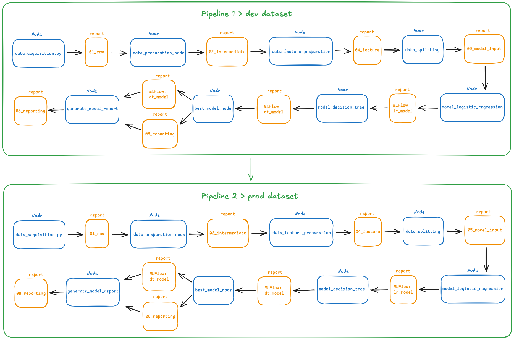
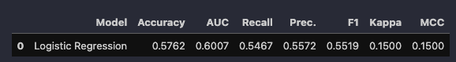
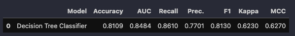

# Kobe Shot Model

Github: https://github.com/vertocode/kobe-shot-model

## Jump To

- [Setup](/docs/SETUP.md)
- [Introduction](#introduction)
- [Project Flow Diagram](#project-flow)
- [How Do Streamlit, MLFlow, PyCaret, and Scikit-Learn Support the Pipeline?](#how-do-streamlit-mlflow-pycaret-and-scikit-learn-support-the-pipeline)
- [Dataset Dimensions](#dataset-dimensions)
- [Train-Test Split and Bias Mitigation](#train-test-split-and-bias-mitigation)
- [Choosing Between Logistic Regression and Decision Tree Models](#choosing-between-logistic-regression-and-decision-tree-models)

## Introduction

The **Kobe Shot Model** project is part of my **postgraduate** course in **Machine Learning Engineering** at **INFNET University**. The goal of this project is to predict whether Kobe Bryant successfully made a basket based on various features of his shot attempts throughout his NBA career. This machine learning pipeline leverages historical game data, including shot distance, game period, and player position, to create models that predict the success or failure of each shot.

In this project, we will explore two machine learning approaches:
- **Regression** to predict the likelihood of a successful shot.
- **Classification** to determine whether the shot was successful or missed.

The project follows the **TDSP (Team Data Science Process)** framework, ensuring a structured approach to data collection, preparation, model training, evaluation, and deployment. The goal is to deliver a robust model that can predict shot outcomes and be easily deployed for future use.

This README will guide you through the steps and processes involved in the project, from data ingestion to model deployment and monitoring.

## Project Flow

Below is the diagram that outlines the steps and processes involved in the **Kobe Shot Model** project, from data ingestion to model deployment and monitoring.

## How Do Streamlit, MLFlow, PyCaret, and Scikit-Learn Support the Pipeline?

**Q: How do these tools assist in building the machine learning pipeline?**

**A:** Each tool plays a crucial role in different stages of the pipeline:

- **MLflow**:
  - **Experiment Tracking**: Logs model parameters, metrics, and artifacts to track experiments.
  - **Model Registry**: Stores different versions of models, facilitating easy comparison and deployment.
  - **Monitoring**: Helps in evaluating model performance over time.

- **PyCaret**:
  - **Automated Training**: Simplifies the process of training and comparing multiple models with minimal code.
  - **Model Evaluation**: Provides built-in tools to assess model performance using various metrics.

- **Scikit-Learn**:
  - **Feature Engineering & Preprocessing**: Offers robust tools for feature selection, scaling, and transformation.
  - **Model Training**: Implements various machine learning algorithms, including logistic regression and decision trees.

- **Streamlit**:
  - **Interactive Dashboard**: Enables visualization of predictions and model insights in a user-friendly web app.
  - **Deployment**: Facilitates easy deployment of models with an intuitive UI for end users.

By integrating these tools, the pipeline ensures efficient model training, evaluation, deployment, and monitoring.

## Dataset Dimensions

As part of the data preprocessing for the **Kobe Shot Model**, the dataset was filtered to include only relevant columns, and rows with missing data were removed. The resulting dataset has the following dimensions:

- **Filtered dataset dimensions**: (20285, 7)

This result can be verified in the notebook [dimension_initial_dataset.ipynb](https://github.com/vertocode/kobe-shot-model/blob/main/notebooks/dimension_initial_dataset.ipynb) located in the [notebooks folder](https://github.com/vertocode/kobe-shot-model/tree/main/notebooks). The notebook demonstrates how the filtering process was applied, resulting in a cleaned dataset ready for model training.

You can inspect the details of the dataset and the preprocessing steps by reviewing the notebook.

## Train-Test Split and Bias Mitigation

To ensure robust evaluation of the model's performance, the dataset was randomly split into two subsets: training (80%) and testing (20%). The split was performed using a **stratified** approach to maintain the same distribution of the target variable (shot success/failure) across both datasets. The resulting datasets are stored in the following paths:

- **Training dataset**: `/data/05_model_input/train_dataset_kobe_dev.parquet`
- **Testing dataset**: `/data/05_model_input/test_dataset_kobe_dev.parquet`

This random and stratified split ensures that the model is trained on a representative sample of the data and tested on a different subset to evaluate generalization performance. The dataset split is performed within a node used in the pipeline, which can be observed in the file [data_splitting.py](https://github.com/vertocode/kobe-shot-model/blob/main/src/kedro_ml/pipelines/shot_model/nodes/data_splitting.py).

The choice of training and testing data directly impacts the model's performance and evaluation. If the training data is not representative of the population, or if there is a significant discrepancy between the training and test sets, the model may not generalize well to new, unseen data. This can lead to overfitting or underfitting, affecting the model's real-world applicability.

To minimize data bias and improve the model's reliability:
- **Cross-validation**: Instead of using a single train-test split, cross-validation involves multiple splits of the data to ensure the model's performance is consistent across different subsets of the data.
- **Feature selection**: Choosing the most relevant features helps reduce noise in the model and prevents overfitting, improving its ability to generalize.
- **Handling imbalanced data**: If the dataset contains imbalanced classes (e.g., significantly more shots missed than made), techniques such as oversampling, undersampling, or using class weights in model training can help ensure fair performance across classes.

## Choosing Between Logistic Regression and Decision Tree Models

In this project, we trained two different models: one using **Logistic Regression** and another using a **Decision Tree**. To select the most suitable model, we compared their performance metrics.

As detailed in [this notebook](./notebooks/lg_regression_decision_three.ipynb), the **Decision Tree model** consistently outperformed the Logistic Regression model across all key metrics.

### Logistic Regression

### Decision Tree

### Conclusion

Based on the results shown above, the Decision Tree model achieved superior performance across all evaluation metrics. Therefore, we selected the Decision Tree model as the final model for this project.