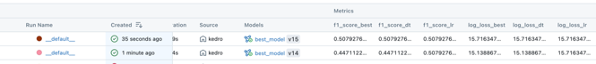

# Kobe Shot Model

Github: https://github.com/vertocode/kobe-shot-model

## Jump To

- [Setup](/docs/SETUP.md)
- [Evaluation Rubric](/docs/EVALUATION_RUBRIC.md)
- [Introduction](#introduction)
- [Project Flow Diagram](#project-flow)
- [Project Artifacts](#project-artifacts)
- [How Do Streamlit, MLFlow, PyCaret, and Scikit-Learn Support the Pipeline?](#how-do-streamlit-mlflow-pycaret-and-scikit-learn-support-the-pipeline)
- [Dataset Dimensions](#dataset-dimensions)
- [Train-Test Split and Bias Mitigation](#train-test-split-and-bias-mitigation)
- [Choosing Between Logistic Regression and Decision Tree Models](#choosing-between-logistic-regression-and-decision-tree-models)
- [MLflow Run Insights and Model Retrieval](#mlflow-run-insights-and-model-retrieval)
- [MLflow Metrics: Log Loss and F1 Score](#mlflow-metrics-log-loss-and-f1-score)
- [Model Monitoring Strategy](#model-monitoring-strategy)
- [Retraining Strategies](#retraining-strategies)

## Setup

You can find the documentation on how to set up this project locally in the [SETUP.md file](docs/SETUP.md).

This document provides instructions on how to set up the MLflow server, run the Kedro pipeline, serve the model as an API, and launch the Streamlit app to make predictions.

## Evaluation Rubric

To help the instructor evaluate whether this project meets the rubric criteria, I created this document [EVALUATION_RUBRIC.MD](docs/EVALUATION_RUBRIC.md) linking each rubric item to the corresponding implementation in the project. Hopefully, this will help save you some time during the review.

## Introduction

The **Kobe Shot Model** project is part of my **postgraduate** course in **Machine Learning Engineering** at **INFNET University**. The goal of this project is to predict whether Kobe Bryant successfully made a basket based on various features of his shot attempts throughout his NBA career. This machine learning pipeline leverages historical game data, including shot distance, game period, and player position, to create models that predict the success or failure of each shot.

In this project, we will explore two machine learning approaches:
- **Regression** to predict the likelihood of a successful shot.
- **Classification** to determine whether the shot was successful or missed.

The project follows the **TDSP (Team Data Science Process)** framework, ensuring a structured approach to data collection, preparation, model training, evaluation, and deployment. The goal is to deliver a robust model that can predict shot outcomes and be easily deployed for future use.

This README will guide you through the steps and processes involved in the project, from data ingestion to model deployment and monitoring.

## Data Categorization

The dataset used in this project was sourced from public NBA shot logs and includes detailed information about each of Kobe Bryant's shot attempts. After collecting the raw data, a preprocessing step was applied to categorize and structure the data in a meaningful way for modeling.

The key categories (features) selected for analysis include:

- `lat` and `lon`: the geographical location on the court where the shot was taken.
- `minutes_remaining`: how many minutes were left in the current quarter.
- `period`: the quarter or overtime period in which the shot occurred.
- `playoffs`: whether the game was a playoff match (1) or a regular season game (0).
- `shot_distance`: the distance of the shot from the basket.
- `shot_made_flag`: the target variable indicating whether the shot was successful (1) or missed (0).

These features were chosen for their predictive value and relevance to game context and player performance. The data was cleaned, filtered, and categorized consistently across both development and production pipelines to ensure model compatibility and accuracy.

## Project Flow

Below is the diagram that outlines the steps and processes involved in the **Kobe Shot Model** project, from data ingestion to model deployment and monitoring.

## Project Artifacts

Throughout the execution of the **Kobe Shot Model** pipeline, several artifacts are created and stored at different stages. Below is a description of each artifact as defined in the `catalog.yml`.

#### 01_raw
- **dev_raw_train** and **prod_raw_train**: Raw datasets in `.parquet` format containing the original inputs for training and validation.

#### 02_intermediate
- **prepared_dev_raw_train** and **prepared_prod_raw_train**: Cleaned and preprocessed datasets after initial preparation steps such as filtering and missing value handling.

#### 04_feature
- **selected_features_dev_raw_train** and **selected_features_prod_raw_train**: Datasets with selected features after feature engineering, ready to be split for training and testing.

#### 05_model_input
- **dev_train_data**, **prod_train_data**, **dev_test_data**, **prod_test_data**: Train/test splits prepared for both development and production pipelines.

#### 06_models
- **lr_model** and **dt_model**: Trained logistic regression and decision tree models, stored and versioned using MLflow.

#### 07_model_output
- **best_model**: The selected model based on evaluation metrics.
- **lr_model_metrics_img** and **dt_model_metrics_img**: Visual evaluation reports (HTML with embedded base64 PNG images) of both models.

#### 08_reporting
- **best_model_report**: CSV file containing classification metrics (Accuracy, F1 Score, Log Loss, Precision, Recall) for the best model selected.

All artifacts are stored under the `/data` directory, organized by pipeline stage to ensure traceability and reproducibility.

## How Do Streamlit, MLFlow, PyCaret, and Scikit-Learn Support the Pipeline?

**Q: How do these tools assist in building the machine learning pipeline?**

**A:** Each tool plays a crucial role in different stages of the pipeline:

- **MLflow**:
  - **Experiment Tracking**: Logs model parameters, metrics, and artifacts to track experiments.
  - **Model Registry**: Stores different versions of models, facilitating easy comparison and deployment.
  - **Monitoring**: Helps in evaluating model performance over time.

- **PyCaret**:
  - **Automated Training**: Simplifies the process of training and comparing multiple models with minimal code.
  - **Model Evaluation**: Provides built-in tools to assess model performance using various metrics.

- **Scikit-Learn**:
  - **Feature Engineering & Preprocessing**: Offers robust tools for feature selection, scaling, and transformation.
  - **Model Training**: Implements various machine learning algorithms, including logistic regression and decision trees.

- **Streamlit**:
  - **Interactive Dashboard**: Enables visualization of predictions and model insights in a user-friendly web app.
  - **Deployment**: Facilitates easy deployment of models with an intuitive UI for end users.

By integrating these tools, the pipeline ensures efficient model training, evaluation, deployment, and monitoring.

## Dataset Dimensions

As part of the data preprocessing for the **Kobe Shot Model**, the dataset was filtered to include only relevant columns, and rows with missing data were removed. The resulting dataset has the following dimensions:

- **Filtered dataset dimensions**: (20285, 7)

This result can be verified in the notebook [dimension_initial_dataset.ipynb](https://github.com/vertocode/kobe-shot-model/blob/main/notebooks/dimension_initial_dataset.ipynb) located in the [notebooks folder](https://github.com/vertocode/kobe-shot-model/tree/main/notebooks). The notebook demonstrates how the filtering process was applied, resulting in a cleaned dataset ready for model training.

You can inspect the details of the dataset and the preprocessing steps by reviewing the notebook.

## Train-Test Split and Bias Mitigation

To ensure robust evaluation of the model's performance, the dataset was randomly split into two subsets: training (80%) and testing (20%). The split was performed using a **stratified** approach to maintain the same distribution of the target variable (shot success/failure) across both datasets. The resulting datasets are stored in the following paths:

- **Training dataset**: `/data/05_model_input/train_dataset_kobe_dev.parquet`
- **Testing dataset**: `/data/05_model_input/test_dataset_kobe_dev.parquet`

This random and stratified split ensures that the model is trained on a representative sample of the data and tested on a different subset to evaluate generalization performance. The dataset split is performed within a node used in the pipeline, which can be observed in the file [data_splitting.py](https://github.com/vertocode/kobe-shot-model/blob/main/src/kedro_ml/pipelines/shot_model/nodes/data_splitting.py).

The choice of training and testing data directly impacts the model's performance and evaluation. If the training data is not representative of the population, or if there is a significant discrepancy between the training and test sets, the model may not generalize well to new, unseen data. This can lead to overfitting or underfitting, affecting the model's real-world applicability.

To minimize data bias and improve the model's reliability:
- **Cross-validation**: Instead of using a single train-test split, cross-validation involves multiple splits of the data to ensure the model's performance is consistent across different subsets of the data.
- **Feature selection**: Choosing the most relevant features helps reduce noise in the model and prevents overfitting, improving its ability to generalize.
- **Handling imbalanced data**: If the dataset contains imbalanced classes (e.g., significantly more shots missed than made), techniques such as oversampling, undersampling, or using class weights in model training can help ensure fair performance across classes.

## Choosing Between Logistic Regression and Decision Tree Models

In this project, we trained two different models: one using **Logistic Regression** and another using a **Decision Tree**. To select the most suitable model, we compared their performance metrics.

As detailed in [this notebook](./notebooks/lg_regression_decision_three.ipynb), the **Decision Tree model** consistently outperformed the Logistic Regression model across all key metrics.

### Logistic Regression

### Decision Tree

### Best model

Based on the results shown above, the Decision Tree model achieved superior performance across all evaluation metrics. Therefore, we selected the Decision Tree model as the final model for this project.

## MLflow Run Insights and Model Retrieval

Each execution of the pipeline automatically logs relevant model metrics and artifacts to **MLflow**, enabling complete experiment tracking and comparison.

In every run, the following details are recorded:
- Model parameters and configuration
- A dedicated run for the **"Data Preparation"** stage, where the dataset was cleaned, filtered, and transformed before modeling. This run includes metadata, preprocessing parameters, and relevant logs.
- Evaluation metrics: **Accuracy**, **F1 Score**, **Log Loss**, **Precision**, **Recall**
- Visual metric summaries for both models (Decision Tree and Logistic Regression)
- Registered models and their versions under the MLflow **Model Registry**

This setup enables not only the **visual inspection** of past runs but also makes it possible to **import and reuse models** registered under the names `lr_model`, `dt_model`, and `best_model`.

Below is an example of how metrics are displayed in the MLflow UI for each pipeline execution:

This integration ensures reproducibility, version control, and transparency throughout the model development lifecycle.

## MLflow Metrics: Log Loss and F1 Score

During model training and evaluation, key metrics such as **Log Loss** and **F1 Score** were calculated and logged using MLflow for both the regression and decision tree models.

- For the **Logistic Regression model**, the **Log Loss** metric was calculated to evaluate the model's prediction confidence and was recorded in MLflow during the model evaluation phase.

- For the **Decision Tree model**, both **Log Loss** and **F1 Score** were calculated and logged in MLflow. These metrics provided a comprehensive view of the model's classification performance and ability to distinguish between shot successes and misses.

These metrics can be reviewed in the MLflow UI under the experiment runs, where each model's performance is tracked and visualized for easy comparison and selection of the best-performing model.

## Model Monitoring Strategy

To ensure the ongoing performance of the deployed model, a monitoring strategy was defined for both scenarios — when the target variable (`shot_made_flag`) is available and when it is not.

#### With Target Variable
When the actual outcome of a shot is known (i.e., the `shot_made_flag` is available), we can monitor the model’s performance using traditional supervised metrics such as:
- **Accuracy**
- **F1 Score**
- **Precision & Recall**
- **Log Loss**

These metrics can be continuously logged and compared over time to detect model degradation.

#### Without Target Variable
When the target is not available (for example, during live predictions before ground truth is known), we apply unsupervised monitoring strategies:
- **Prediction Distribution Shift**: Track the distribution of predicted probabilities over time to identify unusual patterns.
- **Input Feature Drift**: Compare the statistical properties of incoming feature data against the training dataset to detect covariate shift.
- **Confidence Scores**: Monitor confidence levels of the predictions — a sudden drop might indicate model uncertainty.

These techniques help ensure the model remains reliable in real-world usage and provide early warnings for necessary retraining or review.

## Retraining Strategies

To keep the model up to date and performing well over time, two retraining strategies have been defined:

#### Reactive Retraining
This strategy is triggered by performance degradation or anomalies in monitored metrics. For example:
- A drop in F1 Score or accuracy.
- A significant shift in the distribution of prediction probabilities.
- Model performance alerts from MLflow or custom monitoring dashboards.

When triggered, the pipeline is re-executed using recent data to retrain and redeploy the model automatically or with human approval.

#### Predictive Retraining
This is a scheduled strategy based on expected data drift or model aging. Examples include:
- Time-based retraining (e.g., weekly or monthly).
- Volume-based retraining (e.g., every 1000 new data points).
- Periodic evaluation using validation sets, even if no performance issues are observed.

Both strategies are supported by the modular nature of the Kedro pipeline, allowing for easy integration of retraining steps and redeployment.