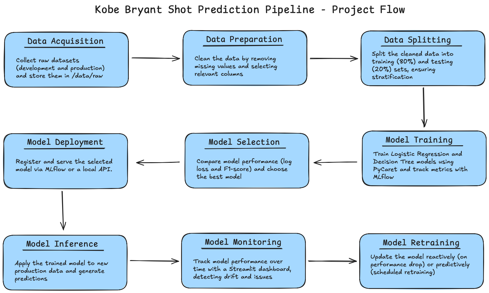

# Kobe Shot Model

## Jump To

- [Project Flow](#project-flow)
- [Setup](/docs/SETUP.md)

## Introduction

The **Kobe Shot Model** project is part of my **postgraduate** course in **Machine Learning Engineering** at **INFNET University**. The goal of this project is to predict whether Kobe Bryant successfully made a basket based on various features of his shot attempts throughout his NBA career. This machine learning pipeline leverages historical game data, including shot distance, game period, and player position, to create models that predict the success or failure of each shot.

In this project, we will explore two machine learning approaches:
- **Regression** to predict the likelihood of a successful shot.
- **Classification** to determine whether the shot was successful or missed.

The project follows the **TDSP (Team Data Science Process)** framework, ensuring a structured approach to data collection, preparation, model training, evaluation, and deployment. The goal is to deliver a robust model that can predict shot outcomes and be easily deployed for future use.

This README will guide you through the steps and processes involved in the project, from data ingestion to model deployment and monitoring.

## Project Flow

Below is the diagram that outlines the steps and processes involved in the **Kobe Shot Model** project, from data ingestion to model deployment and monitoring.

